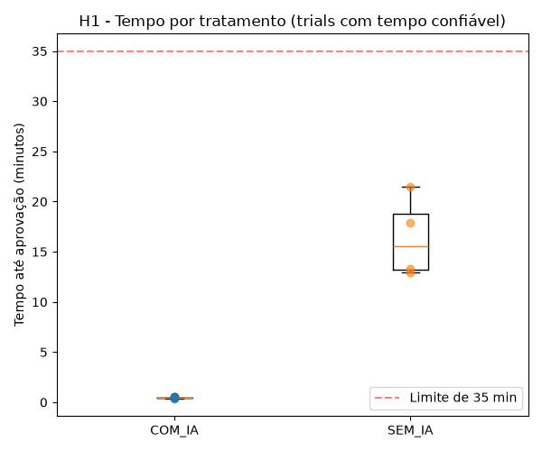
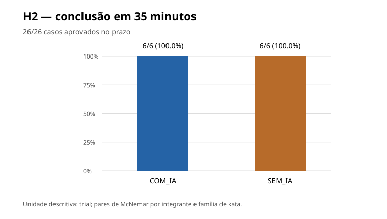
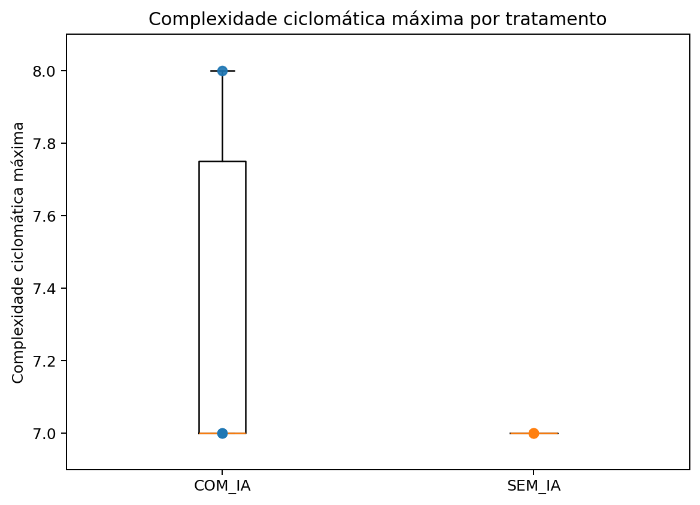
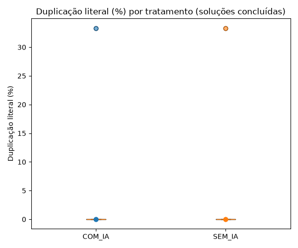

# Laboratório de Experimentação de Software - Lab02: Assistentes de IA vs. Codificação Manual

<table>
<colgroup>
<col style="width: 50%" />
<col style="width: 50%" />
</colgroup>
<thead>
<tr class="header">
<th><strong>Curso</strong></th>
<th>Engenharia de Software</th>
</tr>
</thead>
<tbody>
<tr class="odd">
<td><strong>Disciplina</strong></td>
<td>Laboratório de Experimentação de Software</td>
</tr>
<tr class="even">
<td><strong>Turno / Período</strong></td>
<td>Noite / 6º</td>
</tr>
<tr class="odd">
<td><strong>Professor(a)</strong></td>
<td>Danilo Maia</td>
</tr>
<tr class="even">
<td><strong>Laboratório</strong></td>
<td>Lab02 - Assistentes de IA vs. Codificação Manual</td>
</tr>
<tr class="odd">
<td><strong>Grupo (trio)</strong></td>
<td>Pedro Talma Toledo · Eddie Christian Pereira · José Miguel</td>
</tr>
<tr class="even">
<td><strong>Repositório / GitHub Projects</strong></td>
<td>https://github.com/JoseMiguel-ofc/LABORATORIO-DE-EXPERIMENTACAO-DE-SOFTWARE 
https://github.com/users/JoseMiguel-ofc/projects/1</td>
</tr>
<tr class="odd">
<td><strong>Data de entrega</strong></td>
<td>25/09/2026</td>
</tr>
</tbody>
</table>

O estudo compara, em um desenho pareado por participante, a resolução de katas em Python com e sem assistência de IA. O relatório foi organizado a partir do protocolo, dos scripts, dos CSVs consolidados, dos gráficos da Sprint 3 e do histórico de Issues/commits do repositório.

## 1. Introdução

Assistentes de IA generativa passaram a participar do fluxo de desenvolvimento de software em tarefas como geração de código, explicação e depuração. Apesar da percepção de ganho de produtividade, um experimento controlado precisa separar velocidade, correção e características estruturais do código, além de controlar efeitos de aprendizagem e diferenças entre tarefas. O Lab02 investiga esse cenário por meio de katas pequenos e testáveis em Python, comparando os tratamentos COM_IA e SEM_IA para os mesmos três participantes.

Cada integrante executou quatro trials, um por kata, com metade das tarefas em cada tratamento e limite de 35 minutos por trial. O participante é a unidade de comparação; os 26 casos de teste de cada kata servem para validar a solução, mas não são tratados como observações experimentais independentes.

Questões de Pesquisa e hipóteses:

- RQ1/H1 - Tempo: o uso de IA reduz o tempo até a aprovação completa? Hipótese informal: com IA, o tempo tende a ser menor.

- RQ2/H2 - Correção: o uso de IA aumenta a proporção de trials concluídos com 26/26 testes dentro de 35 minutos? Hipótese informal: com IA, a proporção tende a ser maior.

- RQ3/H3 - Estrutura do código: a complexidade ciclomática máxima difere entre tratamentos? Hipótese exploratória: existe diferença, sem direção prevista; LOC e SLOC são descritores auxiliares.

- Inovação do grupo - Duplicação literal: acrescentar uma métrica de duplicação de código e um pipeline auditável de validação/consolidação para complementar as métricas pedidas no enunciado.

## 2. Contexto

O Lab02 sucede o Lab01 no semestre e reutiliza a infraestrutura de gestão já estabelecida no GitHub Projects. O board do grupo mantém o fluxo Backlog → To Do → Doing → Review → Done e a política de WIP de 3 itens em Doing, equivalente a um item em andamento por integrante. No Lab02, essa estrutura foi usada para distribuir tarefas de instrumentação, preparação dos katas, execução dos trials, validação e análise.

O objeto de estudo é o processo de resolução de quatro katas autorais: ReposicaoEstoque e MetaProducao (família de déficit) e ExcessoBagagem e ConsumoEnergetico (família de excesso). Os problemas foram construídos com interfaces e regras semelhantes e cada kata possui 26 casos de teste, incluindo cenários normais, fronteiras e erros. O conjunto mínimo de quatro katas permite dividir exatamente metade das execuções entre COM_IA e SEM_IA para cada participante.

O protocolo definiu um desenho within-subject, time-box de 2.100 segundos e pareamento por participante/família de kata. A execução real, porém, registrou desvios relevantes: o sorteio formal das sequências S1-S4 não foi realizado, houve diferença entre os assistentes usados e parte dos participantes teve exposição prévia a materiais relacionados aos katas. Essas condições são consideradas na interpretação dos resultados.

## 3. Metodologia

### 3.1 Principais Desafios

- Controlar a dificuldade dos katas: o grupo criou dois pares estruturalmente espelhados, mas similaridade formal não elimina diferenças de familiaridade ou transferência de aprendizagem entre tarefas.

- Evitar contaminação entre tratamentos: em parte dos trials COM_IA, o assistente teve acesso ao repositório completo; além disso, dois trials SEM_IA de Eddie partiram de soluções previamente trabalhadas com apoio do Codex.

- Manter uma instrumentação de tempo confiável: 4 dos 12 registros apresentaram divergência superior a centenas de segundos entre tempo_segundos e a diferença real entre início e fim.

- Trabalhar com amostra reduzida: três participantes produzem poucos pares para testes não paramétricos, exigindo interpretação principalmente descritiva.

- Evitar efeito teto em correção: todos os 12 trials concluíram dentro de 35 minutos, reduzindo a capacidade de RQ2 distinguir os tratamentos.

### 3.2 Tomadas de Decisão

- Adotar quatro katas, o mínimo par previsto, permitindo dois trials COM_IA e dois SEM_IA por participante sem repetir o mesmo problema.

- Usar 35 minutos como limite por trial e exigir aprovação de 26/26 testes para caracterizar conclusão no prazo.

- Mensurar tempo com script próprio e correção com suíte automatizada, separando tempo de implementação do simples tempo de execução dos testes.

- Usar Radon 6.0.1 para LOC/SLOC e complexidade ciclomática; implementar um detector próprio de duplicação literal em blocos de quatro linhas normalizadas como contribuição adicional.

- Consolidar dados pela chave (integrante, kata, tratamento), preservando ausências, rejeitando duplicatas por fonte e gerando diagnóstico auditável.

- Planejar Wilcoxon pareado para tempo/estrutura e McNemar exato para conclusão binária. Quando as condições mínimas não foram atendidas, o relatório não força um p-valor.

### 3.3 Etapas

O trabalho foi dividido em três sprints, refletindo as Issues e os commits do repositório. A distribuição abaixo usa os responsáveis atribuídos às Issues do Lab02.

| **Sprint** | **Entregas principais**                                                                                                    | **Responsável(is)**                                      | **Issues**             |
|------------|----------------------------------------------------------------------------------------------------------------------------|----------------------------------------------------------|------------------------|
| Lab02S01   | Cronometragem e coleta de tempo; configuração do Radon; preparação inicial de katas, protocolo e testes automatizados.     | Pedro Talma Toledo; José Miguel; Eddie Christian Pereira | \#9, \#10, \#11        |
| Lab02S02   | Validação dos trials; inclusão dos dois katas restantes; métrica de duplicação; execução técnica e consolidação auditável. | Pedro Talma Toledo; José Miguel; Eddie Christian Pereira | \#12, \#13, \#14, \#15 |
| Lab02S03   | Execução dos trials reais; análises H1/H2/H3; gráficos; atualização do dataset e relatório final.                          | José Miguel; Pedro Talma Toledo; Eddie Christian Pereira | \#16, \#17, \#18       |

*Tabela 1 - Etapas do Lab02 e rastreabilidade pelas Issues do GitHub.*

Configuração do processo: GitHub Projects (v2), colunas Backlog → To Do → Doing → Review → Done e limite de WIP = 3 na coluna Doing. Os commits do Lab02 fazem referência às Issues correspondentes, mantendo rastreabilidade entre planejamento e implementação.

### 3.4 Ferramentas

- Python 3: linguagem dos katas e dos scripts de coleta/análise. Versões registradas: 3.13.12 para José Miguel e 3.9.6 para Eddie; a versão de Pedro não foi informada no dataset.

- Radon 6.0.1: LOC, LLOC, SLOC e complexidade ciclomática.

- Pandas ≥ 2.0, Matplotlib ≥ 3.7 e SciPy ≥ 1.11: processamento, visualização e testes estatísticos na Sprint 3.

- Scripts próprios: coletar_tempo.py, executar_testes.py, metricas_estaticas.py, metricas_duplicacao.py, consolidar_trials.py, validar_trials.py e scripts de análise H1/H2/H3.

- Assistentes: Claude Code (claude-sonnet-5) em parte dos trials COM_IA e Codex (GPT-6) em outros; a ausência de padronização é tratada como ameaça à validade.

- GitHub Issues/Projects (v2) e Git para gestão, rastreabilidade e versionamento do experimento.

### 3.5 Tabela de Métricas

| **RQ**   | **Métrica**                     | **Definição Operacional**                                                                                                                                              | **Unidade**         | **Ferramenta / Fonte**                        |
|----------|---------------------------------|------------------------------------------------------------------------------------------------------------------------------------------------------------------------|---------------------|-----------------------------------------------|
| RQ1      | Tempo até aprovação             | Segundos desde o início do trial até 26/26 testes aprovados; censura à direita em 2.100 s. Registros inconsistentes entre tempo_segundos e início/fim são sinalizados. | s                   | coletar_tempo.py + executar_testes.py         |
| RQ2      | Conclusão no prazo              | 1 quando o trial registra conclusão, 26/26 casos aprovados e término dentro de 2.100 s; 0 caso contrário. Comparação pareada por integrante/família.                   | proporção / binário | avaliacao_trials.csv + analise_h2_correcao.py |
| RQ3      | Complexidade ciclomática máxima | Maior complexidade ciclomática entre os blocos/funções da solução concluída. LOC e SLOC são descritores auxiliares.                                                    | pontos / linhas     | Radon 6.0.1 + metricas_estaticas.py           |
| Inovação | Duplicação literal              | Percentual de linhas comparáveis pertencentes a blocos duplicados de quatro linhas normalizadas entre soluções do mesmo participante.                                  | %                   | metricas_duplicacao.py                        |

*Tabela 2 - Questões de Pesquisa, métricas, definições operacionais e fontes.*

### 3.6 Inovações Propostas pelo Grupo (30% da nota)

A principal contribuição adicional foi a métrica de duplicação literal, calculada por um script próprio que normaliza linhas e procura blocos repetidos de quatro linhas. A métrica complementa complexidade e tamanho ao observar reaproveitamento textual entre soluções, sem ser tratada como sinônimo de qualidade.

Como inovação de infraestrutura, o grupo também implementou uma cadeia de validação e consolidação auditável. Os coletores preservam os dados brutos; a consolidação relaciona as fontes por chave, recusa duplicatas na mesma fonte, mantém campos ausentes em branco e gera diagnósticos. Na Sprint 3, a análise de H1 acrescentou uma verificação de consistência entre tempo_segundos e a diferença entre timestamps, identificando quatro trials suspeitos antes da comparação de tempo.

## 4. Resultados

### 4.1 Coleta de Dados

A coleta final contém 12 trials: 3 participantes × 4 katas, com 6 execuções COM_IA e 6 SEM_IA. Todas as 12 soluções finais foram aprovadas em 26/26 casos, o que corresponde a 104 casos de teste distintos no conjunto de quatro katas e 312 execuções de casos na validação final dos trials. Os trials foram registrados em 24/09/2026 e as análises consolidadas em 25/09/2026.

Para RQ1, somente 8 dos 12 registros foram considerados confiáveis: 4 COM_IA e 4 SEM_IA. Quatro registros apresentaram divergência substancial entre tempo_segundos e a diferença entre os timestamps de início/fim (dois COM_IA de Eddie e dois SEM_IA de Pedro) e foram excluídos da análise principal de tempo. Após essa filtragem, apenas José Miguel manteve um par completo entre tratamentos, inviabilizando o Wilcoxon pareado como teste inferencial.

Para RQ2 e RQ3, os 12 trials/sua estrutura puderam ser descritos, mas a interpretação continua limitada por tamanho amostral, exposição prévia, ordem ad hoc e falta de uniformidade do assistente de IA.

| **Trials** | **Tempos confiáveis (RQ1)** | **Conclusão no prazo (RQ2)** | **Soluções analisadas (RQ3)** |
|------------|-----------------------------|------------------------------|-------------------------------|
| **12**     | **8/12**                    | **12/12**                    | **12**                        |

*Tabela 3 - Volume efetivamente usado nas análises.*

### 4.2 Visualização Gráfica

**RQ1 - O uso de IA reduz o tempo até a aprovação completa?**

Nos 8 registros confiáveis, a mediana foi 26,05 s em COM_IA e 934,50 s (aprox. 15,6 min) em SEM_IA. As médias foram 26,53 s e 984,26 s, respectivamente. A separação visual é grande, mas não há amostra pareada suficiente para inferência: restou somente 1 participante com par completo confiável.

*Figura 1 - Distribuição do tempo por tratamento nos trials com registro de tempo confiável. A linha tracejada indica o limite de 35 minutos.*

**RQ2 - O uso de IA aumenta a proporção de trials concluídos dentro de 35 minutos?**

Os dois tratamentos atingiram 6/6 conclusões no prazo (100%). Os 6 pares completos tiveram o mesmo resultado nos dois lados, produzindo 0 discordâncias; por isso o teste exato de McNemar não gera p-valor informativo para esta amostra.

*Figura 2 - Proporção de trials concluídos com 26/26 casos dentro de 35 minutos por tratamento.*

**RQ3 - A estrutura do código difere entre COM_IA e SEM_IA?**

A complexidade ciclomática máxima teve mediana 7,0 em ambos os tratamentos e média 7,33 em COM_IA versus 7,0 em SEM_IA. O Wilcoxon pareado reportado no pipeline foi p = 1,0 com apenas 3 participantes, portanto o resultado deve ser interpretado como exploratório. LOC e SLOC também ficaram próximos entre os tratamentos.

*Figura 3 - Complexidade ciclomática máxima por tratamento nas soluções concluídas.*

| **Métrica**         | **COM_IA - mediana / média** | **SEM_IA - mediana / média** | **Resultado pareado**  |
|---------------------|------------------------------|------------------------------|------------------------|
| Complexidade máxima | 7,0 / 7,33                   | 7,0 / 7,0                    | Wilcoxon p = 1,0 (n=3) |
| LOC                 | 20,0 / 22,33                 | 21,0 / 21,0                  | Wilcoxon p = 1,0 (n=3) |
| SLOC                | 16,0 / 17,0                  | 16,0 / 15,33                 | Wilcoxon p = 1,0 (n=3) |

*Tabela 4 - Resumo das métricas estruturais das 12 soluções.*

**Inovação - A duplicação literal acrescenta uma diferença observável entre os tratamentos?**

A mediana de duplicação foi 0% em ambos os tratamentos e a média foi 5,56% em ambos. As diferenças pareadas ficaram nulas no resumo do pipeline, caracterizando empate para esta métrica na amostra.

*Figura 4 - Percentual de duplicação literal por tratamento nas soluções concluídas.*

### 4.3 Discussão

RQ1/H1: os tempos confiáveis apontam descritivamente na direção da hipótese de menor tempo com IA. A diferença de mediana é elevada, mas não pode ser tratada como efeito causal ou confirmação estatística porque quatro tempos foram invalidados pela auditoria, restando apenas um participante com par completo. Além disso, os tempos COM_IA confiáveis de José Miguel e Pedro são muito curtos e refletem geração quase imediata, não necessariamente todo o fluxo humano de leitura, elaboração do prompt e revisão.

RQ2/H2: a hipótese de maior proporção de conclusão com IA não foi confirmada nem refutada. O resultado foi 100% em ambos os braços, um efeito teto que elimina discordâncias para o McNemar. O limite de 35 minutos foi suficiente para todos os trials, tornando o desfecho pouco discriminativo nesta amostra.

RQ3/H3: complexidade máxima, LOC e SLOC permaneceram próximas entre tratamentos. O Wilcoxon p = 1,0 registrado para as métricas não deve ser interpretado como prova de equivalência: com apenas três participantes, a potência é muito baixa e H3 é exploratória.

Inovação: a duplicação literal também não diferenciou os tratamentos, com mediana 0% e média 5,56% em ambos. Ainda assim, o detector próprio foi útil como evidência complementar e, principalmente, demonstrou que uma nova métrica pode ser integrada ao mesmo pipeline de rastreabilidade e consolidação.

As principais ameaças à validade são: amostra de conveniência com apenas três participantes; uso de assistentes diferentes (Claude Code e Codex); acesso do assistente ao repositório completo em parte dos trials; exposição prévia de participantes a enunciados/testes; dois trials SEM_IA com histórico de prática assistida; ausência do sorteio formal das sequências; similaridade estrutural entre os katas; e inconsistência em 4/12 registros de tempo. Essas limitações restringem qualquer generalização para projetos reais, outras linguagens ou outros modelos de IA.

## 5. Conclusão

O Lab02 construiu e executou uma infraestrutura experimental completa para comparar codificação com e sem IA: quatro katas, 104 casos de teste distintos, 12 trials, cronometragem, validação funcional, métricas estáticas, duplicação, consolidação auditável e análises estatísticas por hipótese. O dataset final registra 100% de conclusão funcional nos dois tratamentos e métricas estruturais muito próximas.

Em relação às Questões de Pesquisa, RQ1 apresenta uma diferença descritiva expressiva de tempo a favor de COM_IA nos registros considerados confiáveis, mas os problemas de qualidade do tempo impedem um teste pareado adequado. RQ2 foi inconclusiva por efeito teto, com 100% de conclusão nos dois braços. RQ3 não mostrou diferença estrutural perceptível nesta amostra. A métrica adicional de duplicação também ficou empatada entre tratamentos.

Com mais tempo e recursos, a próxima execução deveria padronizar um único assistente/modelo, isolar o contexto do assistente por trial, sortear e registrar as sequências antes da coleta, usar participantes sem exposição prévia, corrigir a instrumentação de tempo e ampliar a amostra. Também seria útil recalibrar a dificuldade ou o limite temporal para evitar 100% de sucesso nos dois tratamentos e tornar RQ2 mais informativa.

## 6. Referências

GRUPO DO LAB02. LABORATORIO-DE-EXPERIMENTACAO-DE-SOFTWARE: pasta LABORATORIO 02, protocolo experimental, scripts, dados e relatório técnico. GitHub, 2026. Disponível em: https://github.com/JoseMiguel-ofc/LABORATORIO-DE-EXPERIMENTACAO-DE-SOFTWARE. Acesso em: 25 set. 2026.

ZUSE, Horst. A framework of software measurement. Berlin: Walter de Gruyter, 2013.

RADON. Python tool for computing various metrics from source code. Versão 6.0.1, utilizada no Lab02 para métricas estáticas.

YOUTUBE. Vídeo de referência indicado no template da disciplina. Disponível em: https://www.youtube.com/shorts/YwnaeO95AN8. Acesso em: 25 set. 2026.
