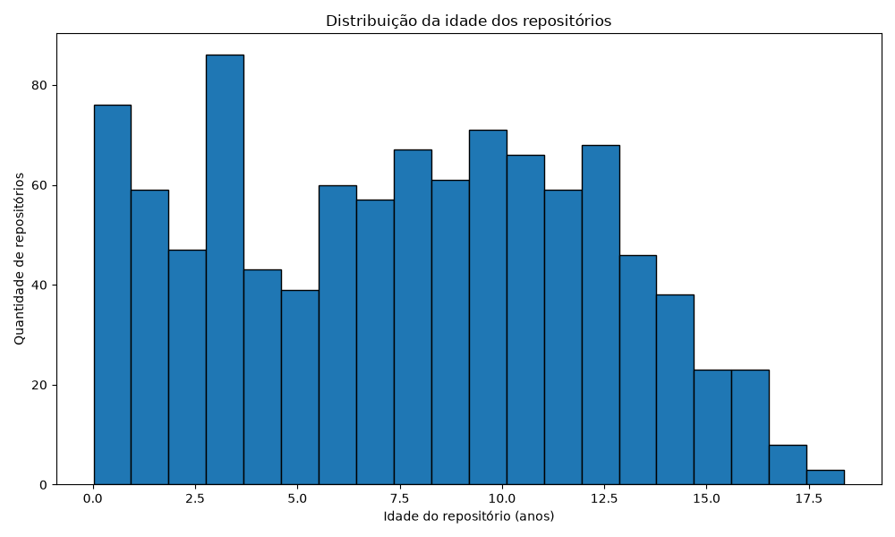
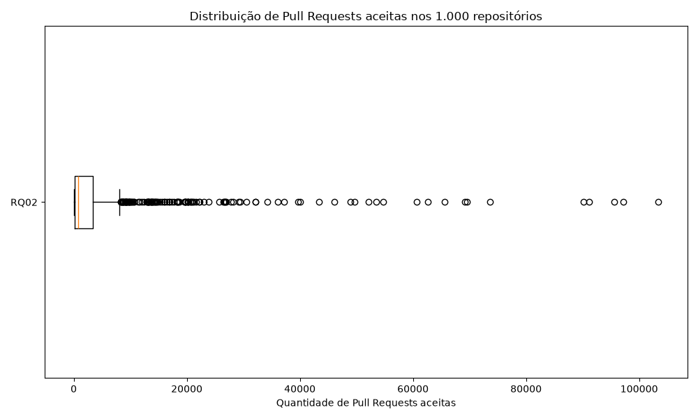
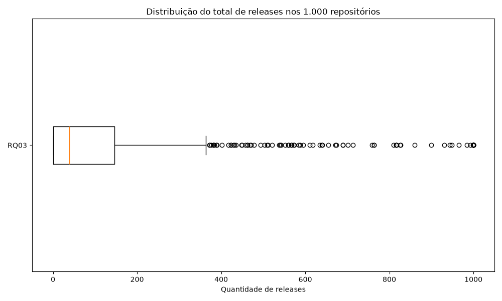
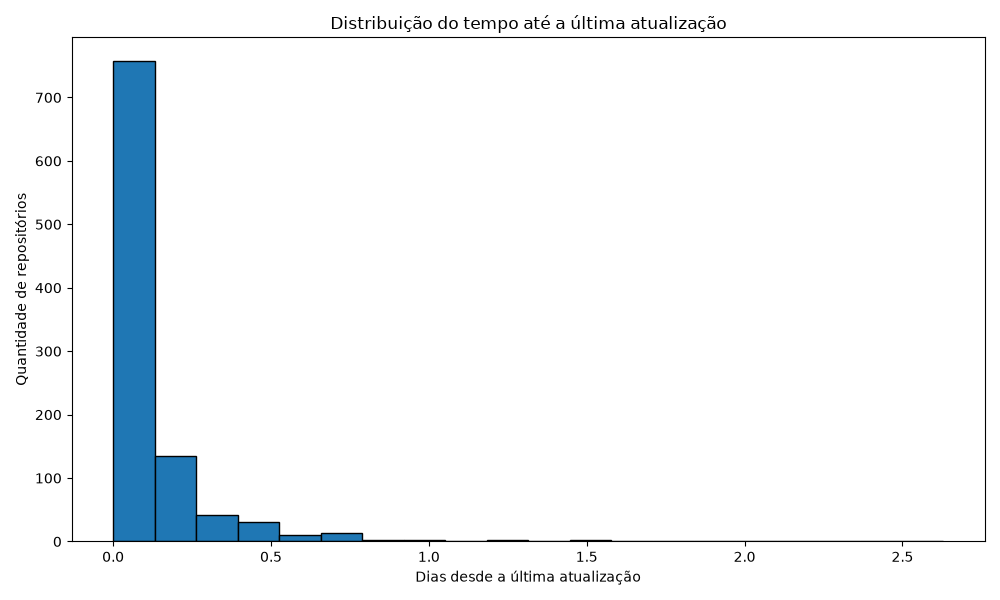
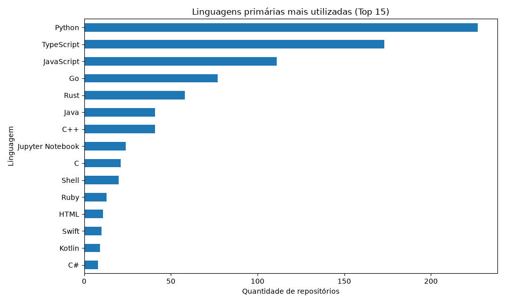
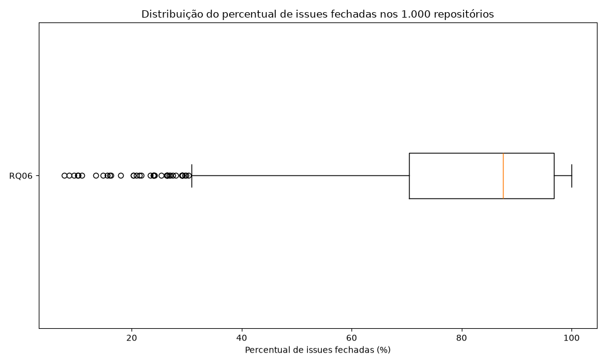
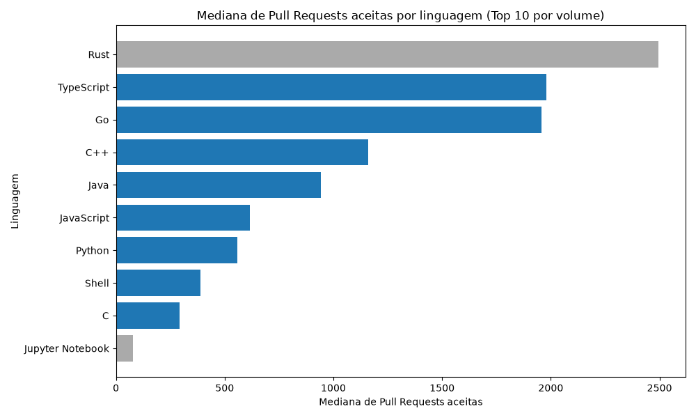
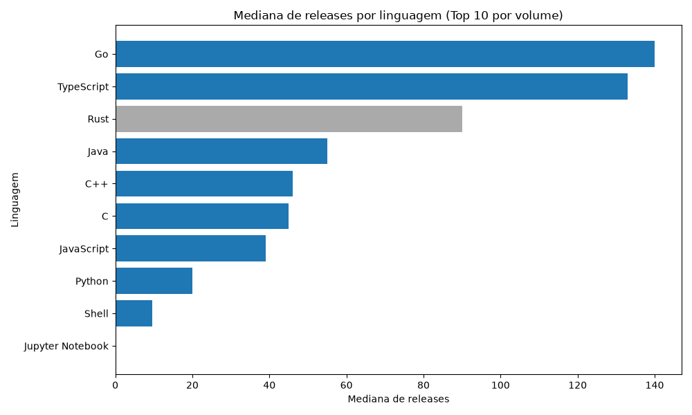
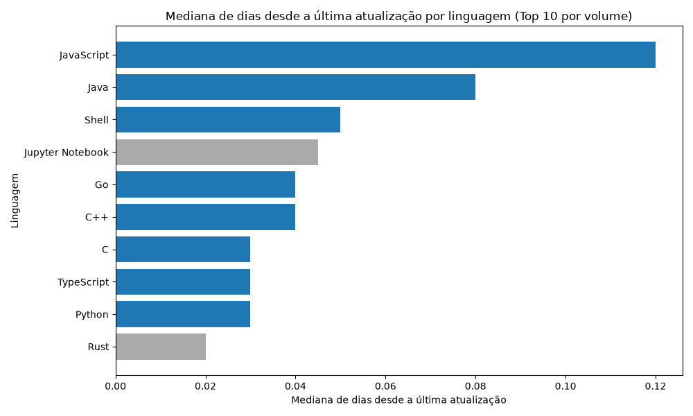

# Relatório de Laboratório

*Laboratório de Experimentação de Software*

| Campo | Valor |
|---|---|
| Curso | Engenharia de Software |
| Disciplina | Laboratório de Experimentação de Software |
| Turno / Período | Noite / 6º |
| Professor(a) | Danilo Maia |
| Laboratório | Lab01 - Repositórios populares |
| Grupo (trio) | Pedro Talma Toledo · Eddie Christian Pereira · José Miguel |
| Link do repositório / GitHub Projects | https://github.com/JoseMiguel-ofc/LABORATORIO-DE-EXPERIMENTACAO-DE-SOFTWARE |
| Data de entrega | 27/08/2026 |

---

## 1. Introdução

O crescimento dos projetos de software open-source hospedados no GitHub permite analisar características de sistemas que alcançaram grande popularidade entre usuários e desenvolvedores. Esse tipo de análise interessa à engenharia de software porque projetos populares funcionam como referência de práticas de manutenção, contribuição e gestão de comunidade — entender o que eles têm em comum ajuda a identificar padrões que favorecem a adoção e a sustentabilidade de um projeto open-source.

Neste laboratório, foram estudados os 1.000 repositórios com maior número de estrelas no GitHub, buscando identificar características relacionadas à maturidade dos projetos, contribuição externa, frequência de releases, atualização, linguagens utilizadas e gerenciamento de issues. O estudo foi organizado a partir das sete questões de pesquisa (RQ01–RQ07) definidas no enunciado do laboratório. Para cada RQ foi estabelecida uma métrica e uma hipótese informal, formulada antes da análise dos dados; em seguida, os dados de 1.000 repositórios foram coletados via API GraphQL do GitHub (script próprio do grupo) e a hipótese foi confrontada com o resultado observado.

**RQ01 — Sistemas populares são maduros/antigos?**
Métrica: idade do repositório (data de coleta − data de criação).
Hipótese informal: espera-se que os repositórios mais populares apresentem vários anos de existência, pois projetos consolidados tendem a acumular visibilidade, usuários e estrelas ao longo do tempo.
Validação preliminar (1.000 repositórios): mediana de **7,74 anos** (Q1 = 3,50; Q3 = 11,35; nenhum outlier acima do limite superior), confirmando a hipótese — repositórios populares são majoritariamente maduros, sem concentração relevante de projetos muito recentes.

**RQ02 — Sistemas populares recebem muita contribuição externa?**
Métrica: total de pull requests aceitas (estado `MERGED`).
Hipótese informal: espera-se um número elevado de pull requests aceitas, já que projetos de grande visibilidade tendem a atrair maior participação de desenvolvedores externos.
Validação preliminar: mediana de **768 pull requests aceitas** (Q1 = 175; Q3 = 3.423,5), com 124 outliers de alto volume (ex.: `firstcontributions/first-contributions` com 103.387) — confirma a hipótese, com forte assimetria à direita puxada por projetos de contribuição massiva.

**RQ03 — Sistemas populares lançam releases com frequência?**
Métrica: total de releases do repositório.
Hipótese informal: espera-se um número relevante de releases, pois repositórios populares tendem a ter ciclos de entrega ativos.
Validação preliminar: mediana de **39 releases**, mas **Q1 = 0** — ou seja, ao menos 25% dos repositórios populares nunca publicaram uma release (comum em listas "awesome", tutoriais e coleções de conteúdo). A hipótese é **parcialmente confirmada**: entre os projetos de software ativo há uso frequente de releases, mas a popularidade por si só não garante esse hábito.

**RQ04 — Sistemas populares são atualizados com frequência?**
Métrica: tempo até a última atualização (data de coleta − `updatedAt`).
Hipótese informal: espera-se um intervalo curto até a última atualização, já que projetos populares costumam ter manutenção ativa.
Validação preliminar: mediana de **0,04 dias (≈ 1 hora)** até a última atualização, com Q3 = 0,12 dias (≈ 2,9 horas) e máximo de 2,63 dias — confirma fortemente a hipótese: os repositórios mais populares do GitHub estão, em sua quase totalidade, em atualização praticamente contínua.

**RQ05 — Sistemas populares são escritos nas linguagens mais populares?**
Métrica: linguagem primária de cada repositório (fonte de referência para "linguagens mais populares": **GitHub Octoverse**, mantida ao longo de todo o laboratório).
Hipótese: sim — linguagens com maior adoção no mercado tendem a ter comunidades maiores, mais bibliotecas prontas e mais desenvolvedores aptos a contribuir.
Validação preliminar: Python, TypeScript e JavaScript concentram as maiores fatias (24,86%, 18,95% e 12,16%, respectivamente), e **79,19%** dos repositórios estão em alguma das 10 linguagens mais populares do Octoverse — confirma a hipótese.

**RQ06 — Sistemas populares possuem um alto percentual de issues fechadas?**
Métrica: razão entre issues fechadas e total de issues.
Hipótese: sim — repositórios com maior visibilidade tendem a atrair mais mantenedores e ter processos de triagem mais maduros.
Validação preliminar: mediana de **87,5%** de issues fechadas (Q1 = 70,42%) — confirma a hipótese. Os outliers de baixo percentual concentram-se em listas "awesome" e materiais didáticos, que não têm ciclo de manutenção ativo de issues.

**RQ07 — Sistemas escritos em linguagens mais populares recebem mais contribuição externa, lançam mais releases e são atualizados com mais frequência?**
Métrica: resultados de RQ02, RQ03 e RQ04, divididos por linguagem (linguagens populares conforme RQ05/Octoverse vs. demais).
Hipótese informal: sim para contribuição e releases (efeito de rede: mais desenvolvedores fluentes na linguagem geram mais PRs e mais entregas), mas não necessariamente para frequência de atualização, que depende mais da maturidade/atividade do projeto do que da linguagem em si.
Validação preliminar: repositórios em linguagens populares (n = 723) têm mediana de **974 PRs aceitas** vs. **732** nas demais linguagens (n = 189); mediana de **61 releases** vs. **28**; já a mediana de dias desde a última atualização é **igual** nos dois grupos (0,04 dias) — **confirma parcialmente** a hipótese: linguagens populares recebem mais contribuição e lançam mais releases, mas não são atualizadas com mais frequência que as demais.

Este laboratório também estabelece o GitHub Projects (v2) do grupo, que será usado como ferramenta de gestão até o final do semestre (ver seção 3.3 — Configuração do processo).

---

## 2. Contexto

Este é o **Lab01** da disciplina, o primeiro do semestre — ele não consome dados de laboratórios anteriores, mas estabelece duas bases que os laboratórios seguintes vão reaproveitar: (i) o script GraphQL próprio de consulta à API do GitHub, cuja lógica de paginação e tratamento de rate limit é reutilizada nos Labs seguintes; e (ii) o GitHub Projects (v2) do grupo, cujos snapshots de fechamento de sprint (exportados a cada sprint via script GraphQL) alimentarão as análises de processo dos Labs 04 e 05.

O objeto de estudo é a população dos **1.000 repositórios com maior número de estrelas no GitHub**, obtidos via busca ordenada por `stars-desc`. Para a RQ05 (linguagens mais populares) e para a RQ07 (que depende diretamente da RQ05), a referência adotada para "linguagens mais populares" é o **GitHub Octoverse**, mantida como fonte única em todo o laboratório para evitar inconsistência entre RQs.

---

## 3. Metodologia

### 3.1 Principais Desafios

- **Rate limit da API GraphQL do GitHub**: com 1.000 repositórios e página de 10 itens por requisição, cada script de mineração realiza ~100 requisições sequenciais. Foi implementado tratamento de erro com até 5 tentativas (`MAX_RETRIES = 5`) e espera exponencial para os códigos HTTP 429/502/503/504, além de leitura do campo `rateLimit` (custo, remanescente, horário de reset) em cada resposta para monitorar o consumo de cota.
- **Paginação de grande volume**: a consulta usa cursor (`pageInfo.endCursor`) para percorrer os 1.000 repositórios em lotes de 10, sem depender de bibliotecas de terceiros para a API do GitHub (exigência do enunciado).
- **Ausência de histórico de status no GitHub Projects**: como a API do GitHub não expõe o histórico de mudança de coluna (Status) de um item do Project, o grupo precisa gerar manualmente um snapshot CSV ao final de cada sprint para reconstituir essa série ao longo do tempo (necessário para os Labs 04/05).
- **Anomalia nos dados de RQ03 (releases)**: 10 repositórios muito ativos (ex.: `langchain-ai/langchain`, `vercel/next.js`, `electron/electron`) retornaram exatamente **1.000** releases — um valor suspeito de coincidência, que sugere um teto interno do campo `totalCount` da API do GitHub para essa conexão, e não o número real de releases desses projetos. Isso é tratado como ameaça à validade na seção 4.3.

### 3.2 Tomadas de Decisão

- **Limite de WIP da coluna Doing: 3** (um item em andamento por integrante), evitando troca de contexto e garantindo que nenhum item fique parado aguardando revisão enquanto outros são iniciados.
- **Definição operacional de "pull request aceita" (RQ02)**: pull requests com estado `MERGED` (`pullRequests(states: MERGED) { totalCount }`), e não apenas `CLOSED`, para excluir PRs fechadas sem merge.
- **Definição operacional de "issue fechada" (RQ06)**: `issues(states: CLOSED).totalCount` dividido pelo total de issues do repositório.
- **Fonte única para "linguagem mais popular" (RQ05/RQ07)**: GitHub Octoverse, mantida do início ao fim do laboratório, evitando misturar critérios (ex.: TIOBE) entre RQs.
- **Amostra**: busca via GraphQL `search(query: "stars:>=1 sort:stars-desc", type: REPOSITORY, ...)`, sem filtro adicional de linguagem, arquivamento ou licença — os 1.000 primeiros resultados retornados pela ordenação por estrelas foram usados integralmente, sem exclusão de repositórios.

### 3.3 Etapas

| Sprint | Entregas | Responsável(is) | Issue(s) |
|---|---|---|---|
| Lab01S01 | Script de mineração e métricas de RQ03/RQ04 (releases e atualização) | Eddie Christian Pereira | #3 |
| Lab01S01/S02 | Script de mineração de RQ01/RQ02, validação em amostra e geração de gráficos | Pedro Talma Toledo | #2 |
| Lab01S02 | Script de mineração de RQ05/RQ06 (1.000 repositórios) e validação | José Miguel | #4 |
| Lab01S03 | Consolidação da análise e visualização das 7 RQs (RQ01–RQ06 + RQ07) em `LAB01S03/` | José Miguel | #5 |

*Os números de Issue acima foram reconstituídos a partir do histórico de commits do repositório; confirmem que batem com os números reais das Issues/Assignees no board antes de entregar, pois é o board que o professor usa para corrigir.*

**Configuração do processo**
- Colunas do board (Status): `Backlog → To Do → Doing → Review → Done`.
- Limite de WIP: **3** para a coluna Doing (um item por integrante — ver justificativa em 3.2).
- Snapshot de fechamento de sprint: exportado via script GraphQL ao final de cada sprint (S01, S02, S03), reaproveitando a lógica de consulta da Parte 1.

*[Inserir aqui o print do board do GitHub Projects ao final do Lab01, mostrando o fluxo real de trabalho do grupo]*

### 3.4 Ferramentas

- **API GraphQL do GitHub** (`https://api.github.com/graphql`) para mineração de dados — script próprio do grupo, sem bibliotecas de terceiros de consulta à API (`urllib` da biblioteca padrão do Python).
- **Python 3** — linguagem usada tanto na mineração quanto na análise.
- **Pandas** — manipulação, agregação e cálculo de estatísticas (mediana, quartis, IQR, outliers) sobre os CSVs coletados.
- **Matplotlib** — geração dos gráficos de validação (histogramas, boxplots e gráficos de barras) em `LAB01S03/*/graficos/`.
- **GitHub Projects (v2)** — ferramenta de processo do grupo, com board em `https://github.com/JoseMiguel-ofc/LABORATORIO-DE-EXPERIMENTACAO-DE-SOFTWARE`.

### 3.5 Tabela de Métricas

| RQ | Métrica | Definição Operacional | Unidade | Ferramenta / Fonte |
|---|---|---|---|---|
| RQ01 | Idade do repositório | Data de coleta − `createdAt` do repositório | Anos | Script GraphQL próprio (API do GitHub) |
| RQ02 | Pull requests aceitas | `pullRequests(states: MERGED).totalCount` | Contagem | Script GraphQL próprio (API do GitHub) |
| RQ03 | Total de releases | `releases.totalCount` | Contagem | Script GraphQL próprio (API do GitHub) |
| RQ04 | Tempo até a última atualização | Data de coleta − `updatedAt` do repositório | Dias | Script GraphQL próprio (API do GitHub) |
| RQ05 | Linguagem primária | Campo `primaryLanguage.name` | Categórica | Script GraphQL próprio; ref. "populares": GitHub Octoverse |
| RQ06 | % de issues fechadas | `issues(states: CLOSED).totalCount / issues.totalCount × 100` | % | Script GraphQL próprio (API do GitHub) |
| RQ07 | PRs, releases e atualização por linguagem | Mediana de RQ02/RQ03/RQ04, agrupada pela linguagem primária (RQ05); comparação linguagens populares (Octoverse) vs. demais | Mediana por grupo | Python/Pandas (`LAB01S03/RQ07/analisar_rq07.py`) |

### 3.6 Inovações Propostas pelo Grupo (30% da nota)

Como contribuição adicional às questões de pesquisa definidas pelo enunciado, o grupo adotou duas inovações complementares: uma relacionada à arquitetura de coleta dos dados e outra relacionada à metodologia de análise estatística.

#### 3.6.1 Coleta resiliente de dados

A primeira inovação consistiu na implementação de mecanismos de tolerância a falhas no script responsável pela coleta de dados através da API GraphQL do GitHub. Durante a execução das consultas, foram observadas falhas temporárias, principalmente erros HTTP 429, 502, 503 e 504.

Para evitar que esses erros interrompessem toda a coleta, o script foi desenvolvido com até cinco tentativas automáticas por requisição e espera exponencial entre as novas tentativas. Além disso, foram coletadas informações do campo `rateLimit` da própria API, permitindo acompanhar o custo de cada consulta, a quantidade de pontos restantes e o horário de renovação da cota.

Essa abordagem foi considerada relevante porque uma coleta envolvendo 1.000 repositórios exige diversas requisições consecutivas e está sujeita tanto às limitações de uso da API quanto a falhas temporárias de comunicação. Sem esse mecanismo, uma única falha poderia interromper o processo e gerar conjuntos de dados incompletos.

Como resultado, foi possível concluir a coleta dos dados dos 1.000 repositórios utilizados no laboratório, mantendo os conjuntos de dados de RQ01, RQ02, RQ03 e RQ04 completos. Os efeitos dessa inovação são apresentados na Seção 4.1, referente à coleta de dados, e considerados novamente na discussão sobre confiabilidade e ameaças à validade.

#### 3.6.2 Análise estatística complementar com quartis e outliers

A segunda inovação foi a utilização de uma análise estatística complementar às métricas solicitadas originalmente. Além dos valores centrais das métricas, foram calculados mediana, primeiro quartil (Q1), terceiro quartil (Q3), intervalo interquartil (IQR) e identificação de valores considerados outliers.

A identificação dos outliers foi realizada utilizando a regra do intervalo interquartil:

Limite inferior = Q1 − 1,5 × IQR

Limite superior = Q3 + 1,5 × IQR

em que:

IQR = Q3 − Q1.

Essa metodologia foi adotada porque diversas métricas relacionadas a repositórios populares apresentam distribuições muito assimétricas. Nesses casos, utilizar apenas a média poderia gerar uma interpretação distorcida dos resultados devido à presença de poucos projetos com valores extremamente elevados.

A análise mostrou, por exemplo, que a RQ02 apresentou mediana de 768 pull requests aceitas, enquanto a média foi de aproximadamente 4.240, sendo identificados 124 repositórios como outliers de alto volume. Isso demonstra que uma pequena parcela dos projetos concentra uma quantidade muito elevada de contribuições externas.

Na RQ03, a análise dos quartis também acrescentou uma informação relevante: apesar da mediana de 39 releases, o primeiro quartil foi igual a zero, indicando que pelo menos 25% dos repositórios analisados não possuíam nenhuma release publicada. Dessa forma, a análise estatística complementar permitiu identificar características da distribuição que não seriam percebidas apenas pela análise da média ou da mediana isoladamente.

Os resultados dessa inovação são apresentados e discutidos nas Seções 4.2 e 4.3, especialmente nas análises das RQ02 e RQ03, e são retomados na Conclusão como evidência de que a popularidade de um repositório não implica necessariamente comportamento homogêneo entre os projetos analisados.

---

## 4. Resultados

### 4.1 Coleta de Dados

Foram coletados dados de **1.000 repositórios** para cada par de RQs (RQ01/RQ02, RQ03/RQ04, RQ05/RQ06), via busca ordenada por número de estrelas (`stars-desc`), sem exclusão de repositórios da amostra. O período de coleta concentrou-se entre **18 e 20 de agosto de 2026** (datas dos commits de mineração).

Completude por CSV:
- **RQ01 (idade) / RQ02 (PRs aceitas)**: 1.000/1.000 registros completos, sem valores ausentes.
- **RQ03 (releases) / RQ04 (atualização)**: 1.000/1.000 registros completos, sem valores ausentes. **Ressalva**: 10 repositórios retornaram exatamente 1.000 releases — valor tratado como possível limite da API, não removido da amostra, mas discutido como outlier suspeito na seção 4.3.
- **RQ05 (linguagem)**: 87 repositórios sem `primaryLanguage` (repositórios sem código-fonte predominante, ex.: coleções de links/documentação) — mantidos na amostra e excluídos apenas do cálculo específico dessa métrica.
- **RQ06 (% issues fechadas)**: 43 repositórios sem issues habilitadas/registradas — mesma tratativa: mantidos na amostra, excluídos do cálculo dessa métrica específica.
- **RQ07**: dataset derivado do merge por repositório entre RQ02, RQ03, RQ04 e RQ05 — resultam **912 repositórios** com linguagem primária conhecida (723 em linguagens populares + 189 em outras), usados na comparação.

### 4.2 Visualização Gráfica

**RQ01 — Sistemas populares são maduros/antigos?**

**RQ02 — Sistemas populares recebem muita contribuição externa?**

**RQ03 — Sistemas populares lançam releases com frequência?**

**RQ04 — Sistemas populares são atualizados com frequência?**

**RQ05 — Sistemas populares são escritos nas linguagens mais populares?**

**RQ06 — Sistemas populares possuem um alto percentual de issues fechadas?**

**RQ07 — Linguagens populares recebem mais contribuição, releases e atualização?**

*(Ao colar no documento final, reinsira as imagens diretamente — os caminhos acima são relativos ao repositório e não são renderizados fora do GitHub/VS Code.)*

### 4.3 Discussão

**RQ01 (confirmada):** mediana de 7,74 anos, sem outliers de idade — os repositórios mais populares do GitHub são, de fato, majoritariamente maduros. A ausência de outliers reforça que não há projetos "virais" muito recentes o suficiente para distorcer a distribuição.

**RQ02 (confirmada):** mediana de 768 PRs aceitas, com forte assimetria (média 4.240 puxada por 124 outliers). A hipótese de alta contribuição externa se confirma, mas a distribuição desigual mostra que "popularidade" não implica um volume homogêneo de contribuição — um pequeno grupo de projetos concentra a maior parte das PRs aceitas.

**RQ03 (parcialmente confirmada):** mediana de 39 releases, mas Q1 = 0 revela que 25% dos repositórios populares nunca lançaram uma release — geralmente listas "awesome" e materiais educacionais, que não seguem um ciclo de release de software tradicional. **Ameaça à validade:** 10 repositórios com exatamente 1.000 releases sugerem um teto no `totalCount` da API do GitHub para essa conexão, o que pode subestimar o valor real desses projetos extremamente ativos e criar empates artificiais no topo da distribuição.

**RQ04 (fortemente confirmada):** mediana de ~1 hora até a última atualização e máximo de apenas 2,63 dias — os repositórios mais populares estão em atualização praticamente contínua, o resultado mais unânime entre as 7 RQs.

**RQ05 (confirmada):** 79,19% dos repositórios estão nas 10 linguagens mais populares do Octoverse, com Python, TypeScript e JavaScript concentrando quase 56% da amostra — reforça a hipótese de que popularidade e adoção de mercado caminham juntas.

**RQ06 (confirmada):** mediana de 87,5% de issues fechadas — os poucos outliers de baixo percentual (ex.: listas "awesome", tutoriais) fazem sentido, pois não têm ciclo de manutenção ativo de issues.

**RQ07 (parcialmente confirmada):** repositórios em linguagens populares têm mediana maior de PRs aceitas (974 vs. 732) e de releases (61 vs. 28), confirmando o efeito de rede esperado. Porém, a mediana de tempo até a última atualização é **idêntica** entre os dois grupos (0,04 dias) — a frequência de atualização dos repositórios mais populares parece já estar em um teto tão baixo (essencialmente diário) que a linguagem deixa de ser um fator discriminante nessa métrica específica.

**Ameaças à validade:** (i) a amostra reflete um instante específico de coleta (18–20/08/2026) — métricas como PRs aceitas e releases só tendem a crescer, então uma nova coleta em outra data teria valores absolutos maiores, mas a forma da distribuição deve se manter; (ii) o teto aparente de 1.000 no `totalCount` de releases (RQ03) pode subestimar projetos extremamente ativos; (iii) repositórios sem `primaryLanguage` (RQ05/RQ07) ou sem issues habilitadas (RQ06) foram excluídos apenas da métrica específica, não da amostra geral, o que é consistente mas reduz o `n` efetivo dessas RQs.

---

## 5. Conclusão

## 5. Conclusão

Das 7 questões de pesquisa investigadas, 5 foram confirmadas de forma direta (RQ01, RQ02, RQ04, RQ05 e RQ06) e 2 foram parcialmente confirmadas (RQ03 e RQ07). Em conjunto, os resultados desenham um perfil consistente de repositório popular no GitHub: um projeto maduro, com mediana de quase 8 anos, atualizado quase continuamente, escrito predominantemente em uma linguagem de grande adoção de mercado segundo o Octoverse, com alto percentual de issues resolvidas e elevado volume de contribuição externa por meio de pull requests — mas não necessariamente com um ciclo formal de releases (RQ03) nem com uma relação direta entre linguagem popular e frequência de atualização (RQ07).

Como contribuição adicional ao enunciado do laboratório, o grupo implementou mecanismos de resiliência na coleta de dados, utilizando tentativas automáticas, espera exponencial em caso de falhas temporárias e acompanhamento do rate limit da API GraphQL do GitHub. Essa estratégia contribuiu para tornar o processo de coleta mais robusto e permitiu concluir a obtenção dos dados dos 1.000 repositórios mesmo diante de falhas temporárias da API.

Também foi utilizada uma análise estatística complementar baseada em mediana, quartis, intervalo interquartil (IQR) e identificação de outliers. Essa abordagem permitiu observar características que não seriam evidentes apenas por meio da média. Na RQ02, por exemplo, a diferença entre média e mediana e a identificação de 124 outliers mostraram uma forte concentração de pull requests aceitas em determinados projetos. Já na RQ03, o primeiro quartil igual a zero evidenciou que pelo menos 25% dos repositórios analisados não possuíam releases publicadas.

Dessa forma, as inovações propostas pelo grupo contribuíram tanto para aumentar a confiabilidade da coleta quanto para aprofundar a interpretação dos resultados obtidos, mostrando que repositórios populares podem apresentar comportamentos bastante distintos mesmo dentro de uma mesma amostra.

**Limitações do estudo:** amostra única, sem replicação em outra data; possível teto artificial no `totalCount` de releases da API do GitHub; e exclusão pontual de repositórios sem linguagem ou issues habilitadas em métricas específicas.

---

## Referências

- ZUSE, Horst. *A framework of software measurement*. Walter de Gruyter, 2013.
- GITHUB. *Octoverse* — relatório anual sobre linguagens e tendências no GitHub. Disponível em: https://octoverse.github.com/
- GITHUB. *GraphQL API documentation*. Disponível em: https://docs.github.com/en/graphql
